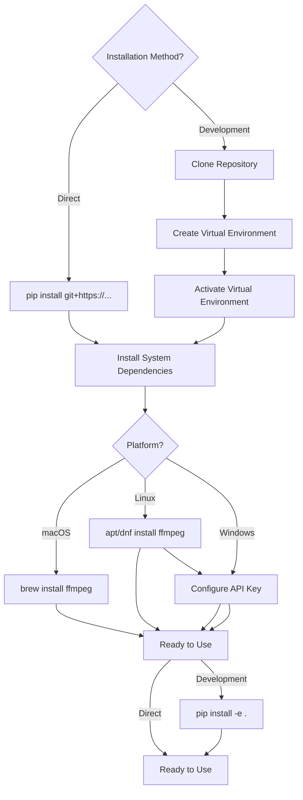
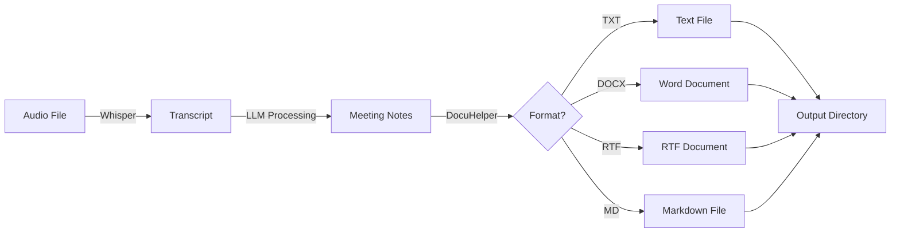
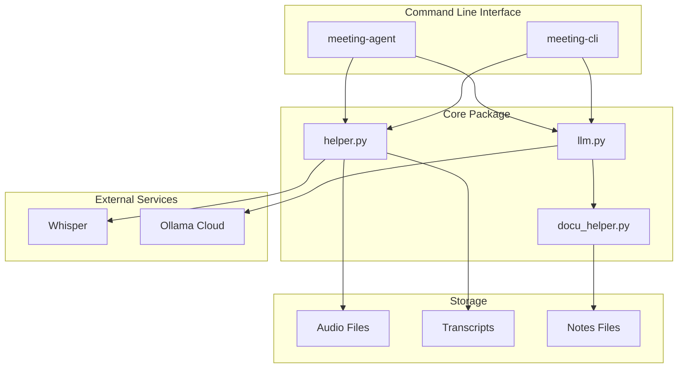

# Meeting Agent

[](https://www.python.org/downloads/)
[](https://github.com/YavinOwens/GenAI_Meetings_Agent)
[](LICENSE)

A Python package for transcribing audio, processing meeting transcripts, and generating structured meeting notes using LLM technology. Transform raw meeting recordings into well-formatted, distributable meeting minutes with action items, decisions, and executive summaries.

## Table of Contents

- [Features](#features)
- [Installation](#installation)
- [Configuration](#configuration)
- [Quick Start](#quick-start)
- [Usage Guide](#usage-guide)
- [Project Structure](#project-structure)
- [Development](#development)
- [Documentation](#documentation)
- [Support](#support)

## Features

- **Audio Transcription**: Local Whisper transcription with GPU acceleration (Metal on macOS)
- **LLM-Powered Notes**: Generate professional meeting minutes using Ollama cloud models
- **Multiple Formats**: Export notes in TXT, DOCX, RTF, or Markdown formats
- **Interactive CLI**: Query transcripts interactively with natural language questions
- **Sentiment Analysis**: Analyze overall document sentiment and per-attendee sentiment (Streamlit UI)
- **APA Citations**: Automatic APA 7th edition citations for AI-generated content
- **Professional Format**: Structured meeting minutes with action items, decisions, and executive summaries
- **Token Tracking**: Monitor token usage and costs with tiktoken integration

## Installation

### Prerequisites

- Python 3.12 or higher
- `ffmpeg` (required for audio transcription)
- Ollama cloud API key

### System Dependencies

#### macOS

Install `ffmpeg` using Homebrew:

```bash
brew install ffmpeg
```

#### Linux

```bash
# Ubuntu/Debian
sudo apt-get update && sudo apt-get install ffmpeg

# Fedora
sudo dnf install ffmpeg
```

#### Windows

Download `ffmpeg` from [ffmpeg.org](https://ffmpeg.org/download.html) and add it to your PATH.

### Python Package Installation

#### Install with Streamlit UI (includes sentiment analysis)

For the full GUI experience with sentiment analysis:

```bash
pip install "meeting-agent[StreamlitUI]"
python -m spacy download en_core_web_sm  # Required for named entity recognition
```

#### Option 1: Install directly from GitHub (Recommended)

You can install the package directly from GitHub using pip:

```bash
pip install git+https://github.com/YavinOwens/GenAI_Meetings_Agent.git
```

Or install from a specific branch:

```bash
pip install git+https://github.com/YavinOwens/GenAI_Meetings_Agent.git@main
```

This will automatically install all required dependencies and make the `meeting-agent` and `meeting-cli` commands available.

#### Option 2: Clone and install in editable mode

1. Clone the repository:

```bash
git clone https://github.com/YavinOwens/GenAI_Meetings_Agent.git
cd GenAI_Meetings_Agent
```

2. Create a virtual environment (recommended):

```bash
python -m venv venv
source venv/bin/activate  # On Windows: venv\Scripts\activate
```

3. Install the package in editable mode:

```bash
pip install -e .
```

This will install all required dependencies and make the package available as `meeting-agent` and `meeting-cli` commands.

### Installation Flow



## Configuration

### API Key Setup

1. Create an `api_key.txt` file in the project root:

```bash
echo "your_ollama_api_key_here" > api_key.txt
```

Or use the format:

```
apikey=your_ollama_api_key_here
```

2. Alternatively, set the `OLLAMA_API_KEY` environment variable:

```bash
export OLLAMA_API_KEY="your_ollama_api_key_here"
```

### Environment Variables

- `OLLAMA_API_KEY`: Ollama cloud API key (alternative to `api_key.txt`)
- `MEETING_AGENT_DEBUG`: Set to `1` to enable debug instrumentation logging

### Directory Structure

The application expects the following directory structure:

```
meeting_agent/
├── Soundrecording_raw/
│   ├── Transcripts/          # Generated transcripts and notes
│   ├── mp3/                  # Audio files (optional)
│   └── other_soundsformat/   # Audio files (optional)
```

Directories are created automatically when needed.

## Quick Start

### 1. Transcribe Audio and Generate Notes

```bash
meeting-agent --transcribe "path/to/audio.m4a"
```

This will:

1. Transcribe the audio file using Whisper
2. Generate professional meeting notes
3. Save both transcript and notes in `Soundrecording_raw/Transcripts/`

### 2. Generate Notes from Existing Transcript

```bash
meeting-agent
```

This automatically finds the most recent transcript and generates notes.

### 3. Interactive CLI for Querying Transcripts

```bash
meeting-cli
```

Ask questions about your transcripts interactively:

```
Question: What were the main action items discussed?
Question: Who was responsible for the budget review?
```

### 4. Streamlit GUI (with Sentiment Analysis)

Launch the interactive web-based GUI:

```bash
meeting-agent-streamlit
```

The Streamlit interface provides:

- **Audio Transcription**: Upload and transcribe audio files
- **Transcript Upload**: Upload existing transcripts
- **Generate Notes**: Create structured meeting notes
- **Q&A Chat**: Ask questions about transcripts
- **Downloads**: Download notes in multiple formats
- **Sentiment Analysis**: Analyze overall and per-attendee sentiment

#### Sentiment Analysis Features

The sentiment analysis tab provides:

- **Overall Sentiment**: Compound score and breakdown (positive/neutral/negative percentages)
- **Per-Attendee Sentiment**: When named entities are detected, analyze sentiment for each attendee
- **Visual Indicators**: Emoji and color-coded sentiment labels
- **Detailed Metrics**: Compound scores, mention counts, and sentiment breakdowns

**Note**: Sentiment analysis requires additional dependencies:
```bash
pip install vaderSentiment spacy pandas
python -m spacy download en_core_web_sm
```

## Usage Guide

### Command-Line Interface

#### `meeting-agent` - Main Script

Generate meeting notes from audio files or existing transcripts.

**Options:**

- `--transcribe AUDIO_FILE`: Transcribe an audio file before generating notes
- `--whisper-model {tiny,base,small,medium,large}`: Whisper model size (default: `base`)
- `--no-notes`: Only transcribe audio, don't generate meeting notes

**Examples:**

```bash
# Transcribe and generate notes
meeting-agent --transcribe "meeting.m4a"

# Use a larger Whisper model for better accuracy
meeting-agent --transcribe "meeting.m4a" --whisper-model large

# Only transcribe (no notes)
meeting-agent --transcribe "meeting.m4a" --no-notes

# Generate notes from most recent transcript
meeting-agent
```

#### `meeting-cli` - Interactive Query Interface

Interactive command-line interface for asking questions about transcripts.

**Commands:**

- Type your question and press Enter
- `reload`: Reload the most recent transcript
- `load <filename>`: Load a specific transcript file
- `help`: Show help message
- `quit` or `exit`: Exit the CLI

**Example Session:**

```bash
$ meeting-cli
============================================================
Meeting Agent CLI - Interactive Question Interface
============================================================
Model: gpt-oss:120b-cloud

SUCCESS: Loaded transcript: sample_meeting_2024-01-11.txt
  Length: 66455 characters

Question: What were the key decisions made?
Answer: [LLM response with key decisions]

Question: Who is responsible for the budget review?
Answer: [LLM response with owner information]
```

### Python API

```python
from meeting_agent import MeetingAgent, create_meeting_agent
from pathlib import Path

# Create a meeting agent
agent = create_meeting_agent()

# Read a transcript
transcript_path = Path("Soundrecording_raw/Transcripts/meeting.txt")
with open(transcript_path) as f:
    transcript = f.read()

# Generate meeting notes
response = agent.generate_meeting_notes(transcript)
notes = response.get("notes", "")

# Save notes
from meeting_agent import save_meeting_notes
save_meeting_notes(
    notes=notes,
    transcript_path=transcript_path,
    format="docx"  # or "txt", "rtf", "md"
)
```

### Workflow Diagram



### Document Formats

The application supports multiple output formats:

- **TXT**: Plain text format
- **DOCX**: Microsoft Word format with formatting, tables, and APA citations
- **RTF**: Rich Text Format for cross-platform compatibility
- **MD**: Markdown format with APA citations

All formats include:

- Professional meeting minutes structure
- Action items table
- Decisions table
- Executive summary
- APA 7th edition citations for AI-generated content

### Transcription Options

Whisper model sizes (larger = more accurate, slower):

- `tiny`: Fastest, least accurate
- `base`: Balanced (default)
- `small`: Better accuracy
- `medium`: High accuracy
- `large`: Best accuracy, slowest

On macOS with Metal GPU support, transcription is automatically accelerated.

## Project Structure

```
meeting_agent/
├── meeting_agent/          # Main package
│   ├── __init__.py        # Package exports
│   ├── helper.py          # Utility functions, color formatting, file ops
│   ├── llm.py             # MeetingAgent class and LLM integration
│   ├── docu_helper.py    # Document generation (TXT, DOCX, RTF, MD)
│   ├── scripts/           # Executable scripts
│   │   ├── meeting_agent.py  # Main transcription/notes script
│   │   └── meeting_cli.py    # Interactive CLI
│   └── prompt_gallery/    # LLM prompt templates
├── scripts/               # Legacy scripts (for backward compatibility)
├── Soundrecording_raw/    # Audio files and transcripts
│   └── Transcripts/       # Generated transcripts and notes
├── pyproject.toml         # Package configuration
├── requirements.txt       # Python dependencies
└── README.md             # This file
```

### Architecture Diagram



### Key Modules

- **`meeting_agent.helper`**: Core utilities including color formatting, file operations, prompt loading, token counting, and audio transcription
- **`meeting_agent.llm`**: `MeetingAgent` class that processes transcripts and generates structured notes using role/task framework
- **`meeting_agent.docu_helper`**: Document generation with support for multiple formats and APA citations
- **`meeting_agent.scripts`**: Command-line entry points for transcription and interactive querying

## Development

### Setting Up Development Environment

1. Clone the repository and install in editable mode:

```bash
git clone https://github.com/YavinOwens/GenAI_Meetings_Agent.git
cd meeting_agent
python -m venv venv
source venv/bin/activate
pip install -e ".[dev]"
```

2. Install development dependencies:

```bash
pip install ruff  # Code linting and formatting
```

### Code Quality

The project uses [Ruff](https://github.com/astral-sh/ruff) for linting and formatting.

**Check code quality:**

```bash
ruff check .
```

**Auto-fix issues:**

```bash
ruff check --fix .
```

**Format code:**

```bash
ruff format .
```

### Running Tests

```bash
# Run all tests
pytest

# Run with coverage
pytest --cov=meeting_agent
```

### Project Organization

The project follows Python package best practices:

- **Package structure**: Library code in `meeting_agent/` package
- **Scripts**: Executable scripts in `meeting_agent/scripts/`
- **Entry points**: Defined in `pyproject.toml` for `meeting-agent` and `meeting-cli`
- **Dependencies**: Managed via `pyproject.toml` and `requirements.txt`
- **Code style**: PEP 8 compliant with Ruff enforcement

### Contributing

1. Fork the repository
2. Create a feature branch (`git checkout -b feature/amazing-feature`)
3. Make your changes
4. Run code quality checks (`ruff check .`)
5. Commit your changes (`git commit -m 'Add amazing feature'`)
6. Push to the branch (`git push origin feature/amazing-feature`)
7. Open a Pull Request

## Documentation

- **API Reference**: See docstrings in source code for detailed API documentation
- **This README**: Comprehensive guide covering installation, usage, and development
- **Source Code**: Well-documented with inline comments and docstrings

## Support

### Issues

If you encounter any issues:

1. Check the [Issues](https://github.com/YavinOwens/GenAI_Meetings_Agent/issues) page
2. Search for existing solutions
3. Create a new issue with:
   - Description of the problem
   - Steps to reproduce
   - Expected vs. actual behavior
   - System information (OS, Python version)

### Troubleshooting

**Problem: `ffmpeg` not found**

```bash
# macOS
brew install ffmpeg

# Verify installation
ffmpeg -version
```

**Problem: API key not working**

- Verify your API key is correct
- Check that `api_key.txt` is in the project root
- Or set `OLLAMA_API_KEY` environment variable

**Problem: Whisper model download fails**

- Check your internet connection
- Whisper downloads models on first use
- Models are cached in `~/.cache/whisper/`

**Problem: GPU acceleration not working (macOS)**

- Ensure you're on macOS with Apple Silicon (M1/M2/M3)
- PyTorch should automatically detect Metal support
- Check logs for "Using Metal GPU acceleration" message

## License

This project is licensed under the Apache License 2.0. See the [LICENSE](LICENSE) file for details.

## Acknowledgments

- [Ollama](https://ollama.com/) for LLM cloud services
- [OpenAI Whisper](https://github.com/openai/whisper) for audio transcription
- [python-docx](https://python-docx.readthedocs.io/) for Word document generation
- [PyRTF3](https://github.com/brendonh/PyRTF3) for RTF document generation
